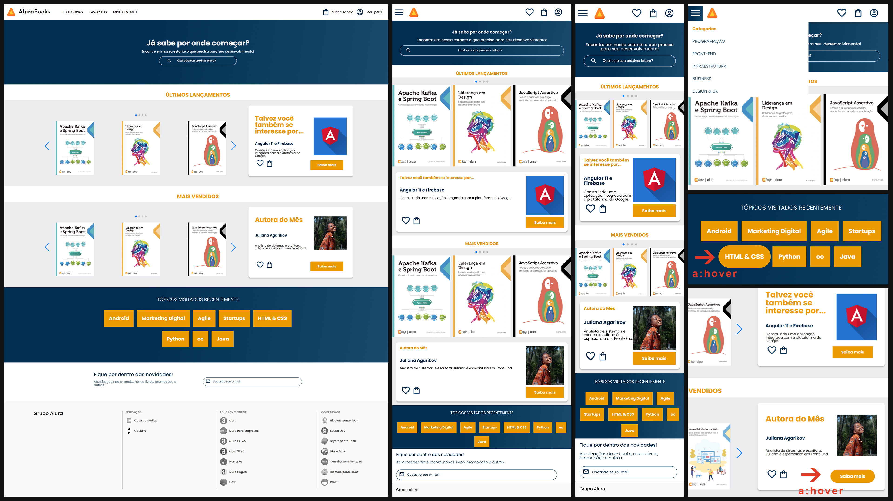

[**ALURA BOOKS**]()

##

**ABOUT ALURA BOOKS**

- The "Alura Books" landing page was an exercise of the course "HTML e CSS: responsividade com mobile-first" from Alura;
- The goal was to practice the basics of the HTML & CSS and build a page for mobile first and then make them responsible for the tablet and desktop;
- We received a Figma file of the design of the landing page where we extracted all the details of the project;

##

**OBERVATIONS**

- I used CSS Grid & Flexbox to position the elements throughout the page and to adapt the layout using media queries;
- [About Alura](https://www.alura.com.br);
